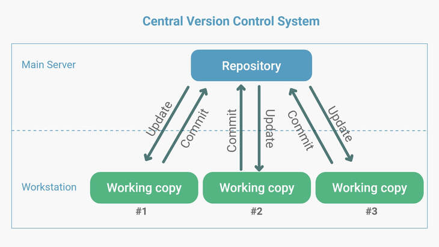
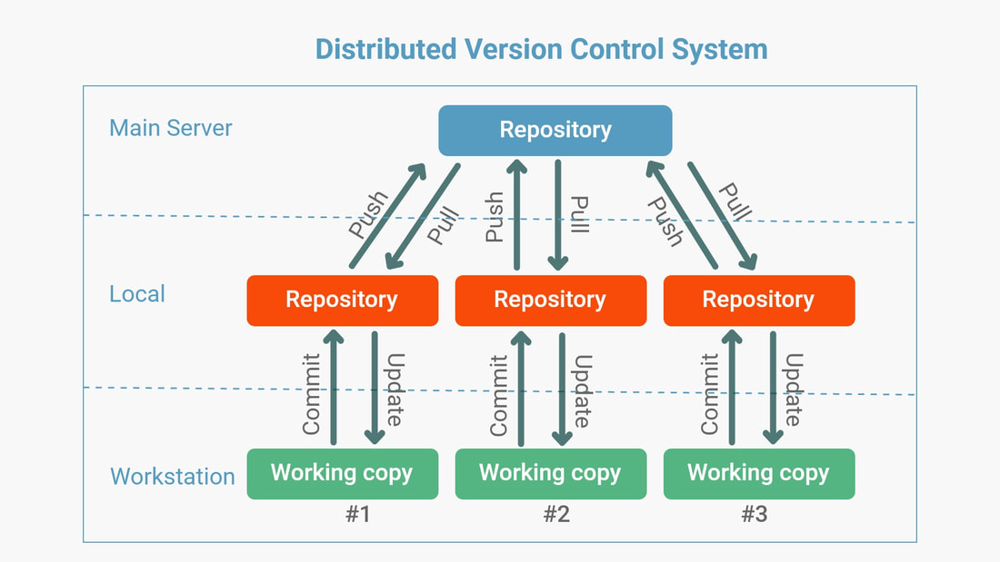

# Git Basics and Centralized vs Distributed Version Control Systems 

## Centralized vs Distributed VCS

### Centralized VCS

In a centralized VCS, there is a single, central repository. Teams would clone the entire repository and push changes directly to this central server.
The cons of using a centralized VCS is that once someone is writing to the file, it remains in a locked state and cannot be worked on by other members, this is problematic as teams get bigger.

### Distributed VCS

In a distributed VCS, every member pulls from the main repo and has their own local repository with complete history and branches. Changes are shared between repositories through pushing, pulling, and merging. This allows teams to work on the same file at the same time.

Git is an example of a distributed version control system

## Common Workflow Commands

1. **Init**: Initialize a repository (creates and tracks with .git).

2. **Add**: Add file changes to the staging area.

3. **Commit**: Record changes to the repository.

4. **Push**: Upload local repository changes to a remote repository.

5. **Pull**: Fetch changes from a remote repository and merge them into the current branch.

6. **Status**: Show the status of working directory and staging area.

## Additional Commands
7. **Log**: Show commit logs.

8. **Diff**: Check the difference between commits.

9. **Checkout**: Change to another commit.

10. **Reset**: Revert to a previous commit (loses changes made after it, use with caution).

## Branching
Branching allows for parallel development without affecting the main branch. It's useful for isolating features, bug fixes, or experiments.

To create a new branch:  
git branch <branch_name>

To switch to a branch:  
git checkout <branch_name>

## Remote add

Remote repositories are repositories hosted on servers or platforms like GitHub, GitLab, or Bitbucket. Adding a remote repository allows you to synchronize changes between your local repository and the remote repository.
11. **Remote**: Adds a remote repository
### Example
git remote add <remote_name> <remote_url>
git remote add origin https://github.com/username/repository.git

This command adds a remote named origin with the URL pointing to a GitHub repository.

## Differences Between Git and GitHub
Git: Git is a distributed version control system (DVCS) used for tracking changes in source code during software development. It allows multiple developers to collaborate on a project and manage their own local repositories.

GitHub: GitHub is a web-based platform that provides hosting for Git repositories. It offers additional features such as issue tracking, pull requests, code review, and project management tools. GitHub facilitates collaboration and serves as a centralized hub for sharing and managing Git repositories.

### Key Differences
1. Functionality: Git is the version control system itself, while GitHub is a hosting service for Git repositories with additional collaboration features.

2. Access: Git is installed locally on a developer's machine, allowing them to work offline. GitHub, on the other hand, is accessed through a web browser and requires an internet connection.

3. Collaboration: Git enables local collaboration between developers, while GitHub facilitates remote collaboration by providing a platform for sharing and managing repositories among team members.

4. Visibility: Git repositories are stored locally by default and can be made public or private based on user preferences. GitHub repositories are typically hosted publicly by default, although private repositories are also available with certain subscription plans.

5. Additional Features: GitHub offers features such as issue tracking, pull requests, code review, and project management tools, which are not available in Git itself.

## Handling Sensitive Information in Git

If you accidentally push sensitive information to a Git repository, follow these steps to mitigate the issue:

1. **Delete the Remote Repository**: Access the remote repository platform (e.g., GitHub, GitLab) and delete the repository containing the sensitive information.

2. **Delete the .git Locally**: In your local project directory, delete the hidden `.git` folder. This removes all Git history and configurations from your local machine.

3. **Remove Sensitive Info from Local Repo**: Manually remove or secure any sensitive information from your local project files.

4. **Reinitialize and Push Local Code**: Reinitialize Git in your project directory, add the remote repository, and push your cleaned code to the remote repository.

## Syncing Local Repository to Remote Repository

To sync your local repository with the remote repository, follow these steps:

1. **Commit Changes**: Make sure all your local changes are committed.

2. **Pull Changes from Remote**: Fetch and merge changes from the remote repository to your local branch.

3. **Push Changes to Remote**: Upload your local changes to the remote repository.

## Removing a Folder/File from Remote Repository

To remove a folder or file from the remote repository after committing:

1. **Delete Locally**: Delete the folder or file from your local repository.

2. **Commit and Push**: Commit the deletion and push the changes to the remote repository.

## Using .gitignore

The `.gitignore` file specifies intentionally untracked files that Git should ignore. To use it:

1. **Create .gitignore**: Create a file named `.gitignore` in your project directory.

2. **Add Patterns**: Add file or directory patterns to `.gitignore` to specify which files Git should ignore.

3. **Commit and Push**: Commit the `.gitignore` file and push it to the remote repository along with your project files.

Using `.gitignore` helps keep your repository clean by excluding unnecessary files and directories.