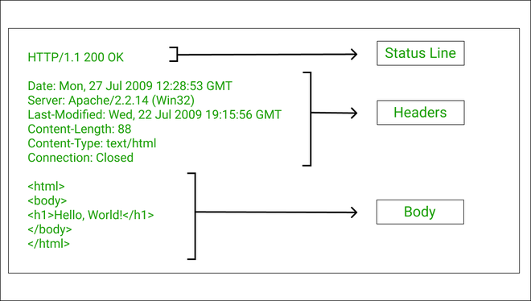

# API Research

## 1. What are APIs?

APIs (Application Programming Interfaces) are sets of rules and protocols that allow different software applications 
to communicate with each other. They are used to define the methods and data formats that applications can use 
to request and exchange information.

### Usage and Popularity

APIs are used to enable integration between different systems, allowing them to share data and functionality. 
They are popular because they simplify development by providing standardized interfaces, promote reusability 
of code and services, and facilitate collaboration between developers and organizations.

## 2. REST API

A REST API (Representational State Transfer API) is a way for different computer systems to communicate with each other over the internet. It's like a set of rules or instructions that tell software applications how they can talk to each other and exchange data.

### What is RESTful?

A RESTful API follows a specific set of rules and principles that make it easy to use and understand. Here are the main things that make an API RESTful:

1. **Stateless Communication**: Each request from a client (like a web browser or mobile app) to the server contains all the information needed to understand and fulfill the request. This means that the server doesn't need to remember anything about the previous requests made by the client.

2. **Client-Server Architecture**: The client and server are separate from each other and can evolve independently. The client sends requests to the server, and the server sends responses back to the client.

3. **Uniform Interface**: A uniform interface is a key principle of RESTful APIs that ensures consistency and predictability in how clients (such as web browsers or mobile apps) interact with the API. This includes:

 - Consistent Actions: Each HTTP method (e.g., GET, POST, PUT, DELETE) in a RESTful API performs a specific action on a resource.

- Resource Representation: Resources (such as data or services) in a RESTful API are represented by URLs (Uniform Resource Locators). Each URL corresponds to a specific resource or collection of resources. For example:
   - `/users`: Represents a collection of user data.
   - `/products/123`: Represents a specific product with ID 123.

- Data Formats: Data exchanged between the client and server in a RESTful API is typically in a standard format like JSON or XML. This ensures that different systems can understand and work with the data consistently.

The uniform interface principle ensures that interacting with a RESTful API is straightforward and consistent. It simplifies development by providing a predictable way to perform actions on resources, making the API easier to understand and use effectively.

### REST Guidelines

To make an API RESTful, developers follow certain guidelines:

- **HTTP Methods**: RESTful APIs use standard HTTP methods to perform different actions on resources:

- **Resource-Based URLs**: Resources are represented by URLs (Uniform Resource Locators). Each URL should represent a specific resource, and the HTTP methods should be used to perform actions on these resources.

- **Data Formats**: Data exchanged between the client and server should be in standard formats like JSON (JavaScript Object Notation) or XML (eXtensible Markup Language). This makes it easy for different systems to understand and work with the data.

Following these guidelines helps developers create APIs that are easy to use, understand, and integrate into different applications.

## 3. HTTP

HTTP (Hypertext Transfer Protocol) is a protocol used for transferring hypertext requests and information on 
the World Wide Web. HTTPS is a secure version of HTTP that encrypts data transmitted between the client and server.

## 4. HTTP Request Structure

A typical HTTP request consists of:
- A request line
- Headers
- An empty line
- An optional message body

## 5. HTTP Response Structure

An HTTP response includes:
- A status line
- Headers
- An empty line
- An optional message body

## 6. HTTP Verbs

- **GET**: Retrieves data from the server.
- **POST**: Sends data to the server to create a resource.
- **PUT**: Updates an existing resource on the server.
- **PATCH**: Partially updates an existing resource.
- **DELETE**: Deletes a resource on the server.

## 7. Statelessness

Statelessness in the context of HTTP means that each request from a client to the server must contain all the 
information necessary to understand the request. Stateless requests do not rely on previous requests. Examples 
of stateless requests include HTTP GET requests. Stateful requests, on the other hand, rely on previous interactions 
and often require session management.

## 8. Caching

Caching is the process of storing copies of files or data in a cache to reduce server load and improve performance. 
Cached data can be reused for subsequent requests, reducing the need for repeated data retrieval from the server.
